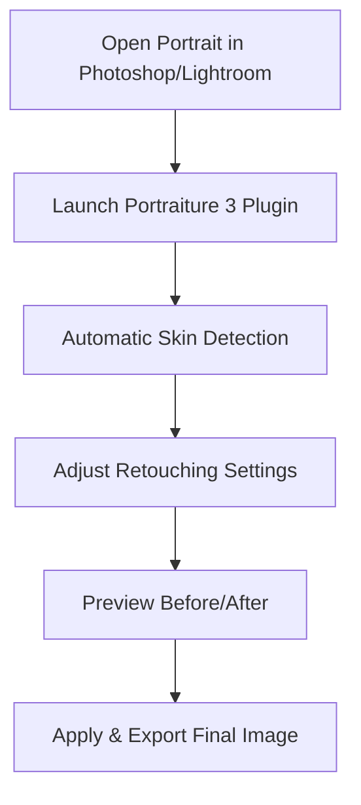

# Imagenomic Portraiture 3 – Advanced Portrait Retouching Plugin

**Imagenomic Portraiture 3** is a professional photo editing plugin designed for **portrait photographers, retouchers, and studios** who want to achieve flawless skin without tedious manual work. With its intelligent algorithms, Portraiture 3 smooths skin, corrects tones, and enhances portraits while preserving natural texture.

Instead of hours of frequency separation and manual retouching, Portraiture 3 gives you **fast, consistent, and natural-looking results** directly inside your editing workflow.

[](#)
[](#)
[](#)
[](#)

---

## 🔎 Overview

Retouching portraits can be time-consuming and technically demanding. **Portraiture 3** automates the process with advanced masking and skin-tone recognition, helping you:

* Smooth skin without blurring facial details.
* Apply precise retouching only where needed.
* Maintain realistic pores, hair, and fine edges.
* Speed up workflow for bulk or studio editing.

---

## ✨ Key Features

* **Automatic Skin Masking:** Detects and isolates skin areas for accurate editing.
* **Natural Skin Smoothing:** Reduces blemishes, wrinkles, and harsh tones while retaining texture.
* **Customizable Presets:** Apply one-click corrections or create your own presets.
* **Edge-Aware Retouching:** Protects hair, eyelashes, and background details.
* **Batch Processing:** Retouch multiple images at once.
* **Advanced Controls:** Fine-tune softness, warmth, contrast, and color balance.

---

## 🖥 Compatibility

Portraiture 3 integrates with the most popular editing platforms:

| Software                         | Supported Platforms | Notes                             |
| -------------------------------- | ------------------- | --------------------------------- |
| Adobe Photoshop                  | macOS & Windows     | Full layer & masking support      |
| Adobe Lightroom Classic          | macOS & Windows     | Batch & catalog editing           |
| Capture One (via plugin routing) | macOS & Windows     | Limited integration               |
| Standalone App                   | macOS & Windows     | For direct editing without a host |

\[!NOTE]
Portraiture 3 supports high-resolution images, including medium-format RAW files.

---

## ⚡ Setup & Workflow

1. Install Portraiture 3 plugin for Photoshop or Lightroom.
2. Open your portrait image.
3. Apply Portraiture 3 filter via **Filter → Imagenomic → Portraiture 3**.
4. Adjust sliders for **smoothing, detail, and tone correction**.
5. Preview before/after in real time.
6. Export final retouched image.

Example retouch settings:

```plaintext
Smoothing: Medium (25%)  
Fine Detail: +10  
Warmth: +5  
Highlights Softening: Enabled  
Skin Mask Opacity: 80%
```

---

## 📊 Workflow Diagram



---

## ❓ FAQ

**Q: Does Portraiture 3 make skin look plastic?**
A: No, its texture-preserving algorithm ensures skin remains natural and realistic.

**Q: Can I use it for batch editing in Lightroom?**
A: Yes, you can apply presets across entire sessions.

**Q: Does it work with RAW files?**
A: Yes, it supports RAW workflows when used with Lightroom or Photoshop.

**Q: Is there a standalone version?**
A: Yes, you can use Portraiture 3 independently without Photoshop or Lightroom.

---

## 🚀 Final Thoughts

**Imagenomic Portraiture 3** is an essential plugin for anyone working with portraits. By combining **intelligent skin detection, natural smoothing, and fast workflow integration**, it’s trusted by photographers worldwide to deliver professional retouching in minutes.

